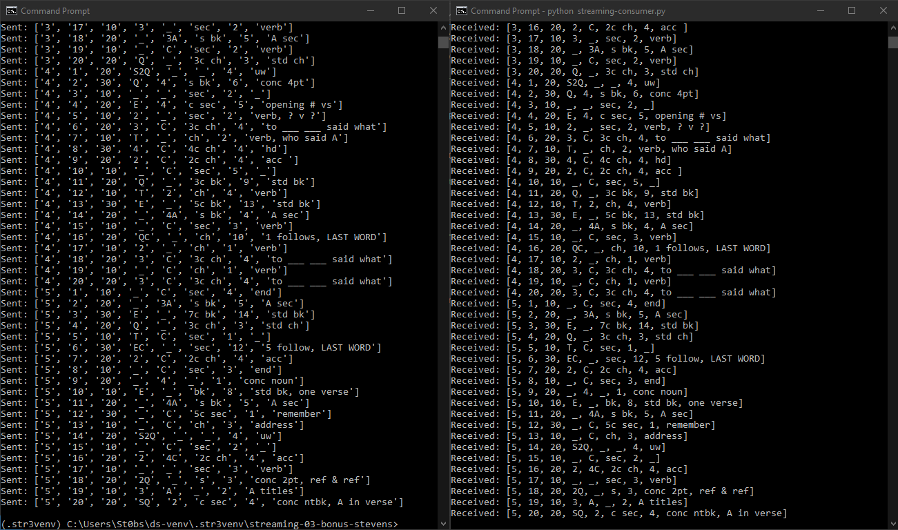

# Streaming Bonus

## Author: Solomon Stevens
## Date: May 17th, 2024

### Read in contents of a CSV file, and stream them to an output via a queue

We take advantage of multiple built-in python libraries (csv, time) to break down 
a CSV file into individual rows and inputs.  Then we take advantage of the external 
library `pika` to send these rows to a queue that can then be streamed to different 
terminals.

## Prerequisites
* Python 3.7+ (3.11+ recommended)
* RabbitMQ Server installed and running locally
* Pika installed for Python

## Notes
* Default CSV file is from computer
* -> Available in this repository